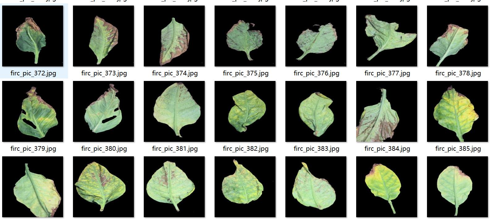
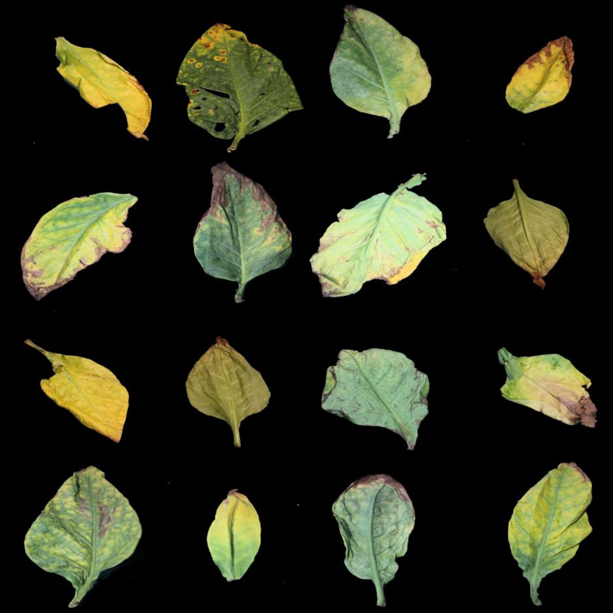
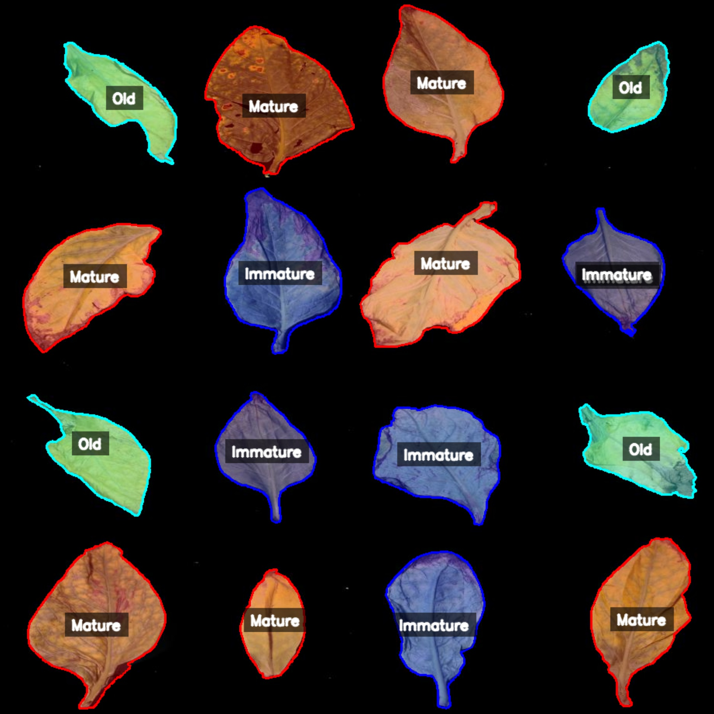
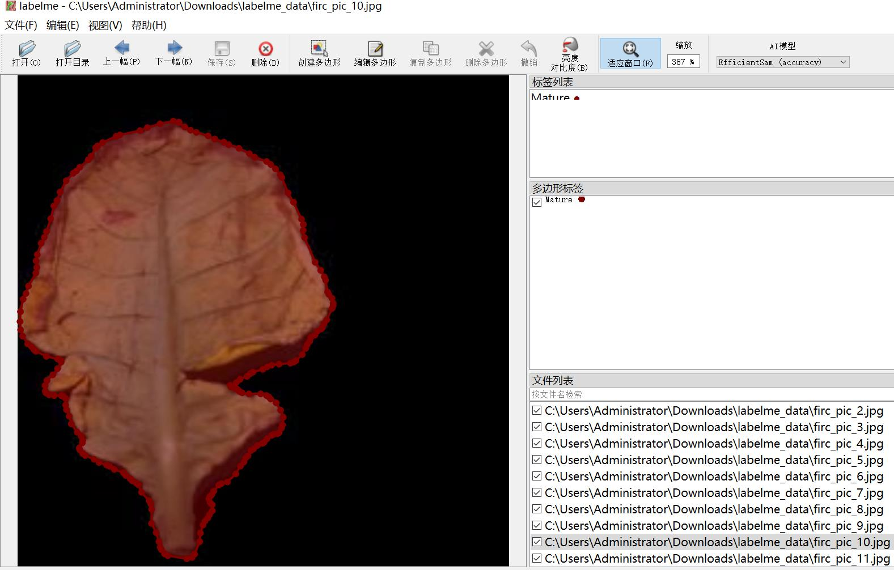

# Labelme format dataset for identifying and segmenting tobacco leaf maturity levels

1240 images in black background with individual leaves, please refer to the image preview for details.

Dataset format: Labelme (without mask files, only containing JPG images and corresponding JSON files)

Number of images (JPG file counts): 1240
Number of annotations (JSON file counts): 1240
Number of annotation categories: 3
Annotation category names: ["Immature", "Mature", "Old"]
Box count per category:
- Immature count = 332
- Mature count = 486
- Old count = 428
Total boxes = 1246

Annotation tool used: labelme v5.5.0
Image resolution: 448x448
Annotation rules: Polygons are drawn around the categories
Important note: The dataset can be opened and edited using Labelme, but the JSON dataset needs to be converted into a format suitable for instance segmentation or semantic segmentation such as Yolo 
or COCO.
Special notice: This dataset does not guarantee the accuracy of the trained models or weight files.

Image preview:
Annotation example:
Original images (randomly selected 16 images):
Annotation drawing results:

## Images

Here is a pay link on Stripe ( https://buy.stripe.com/3cs8yP7sY87d0vu9AB ). Please contact me lonlonago@foxmail.com after funding $89, and I will send you a complete data files , thank you!

